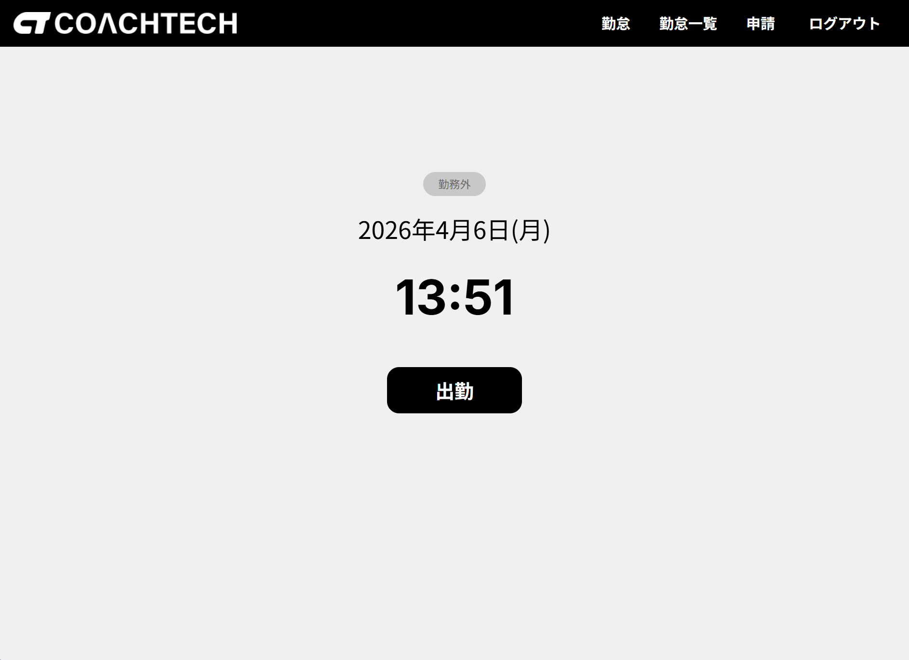
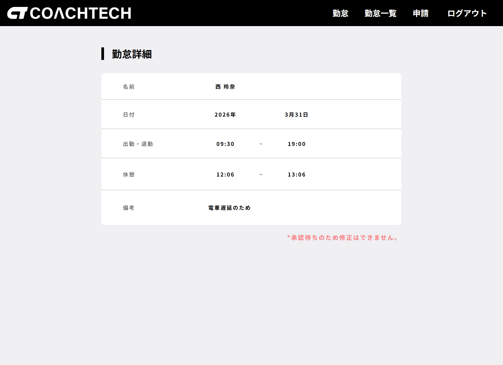
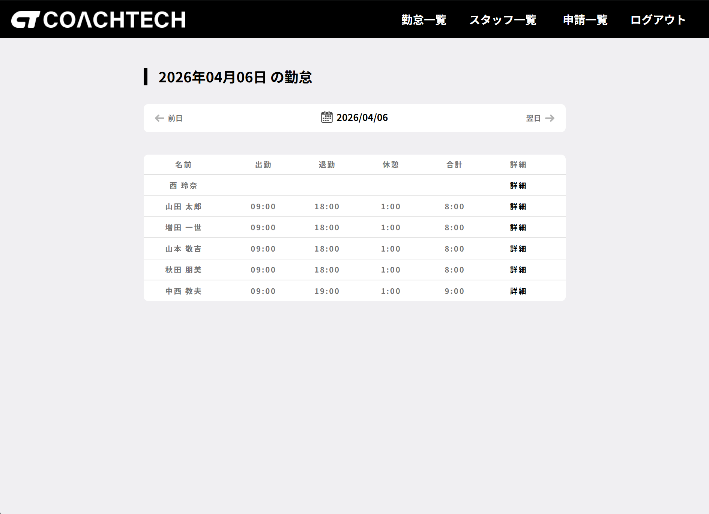
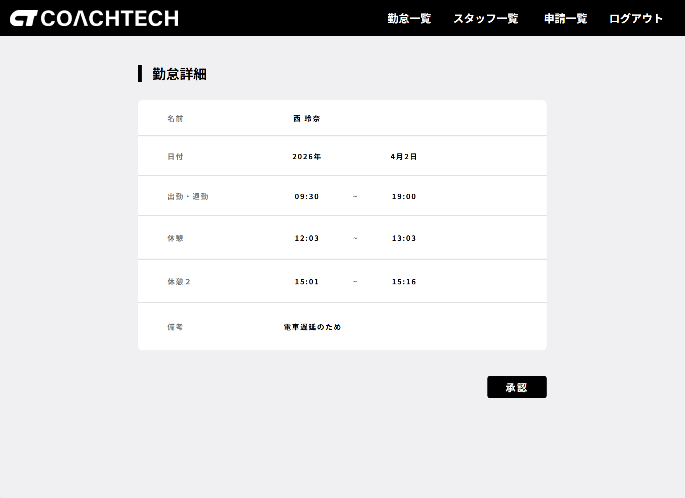
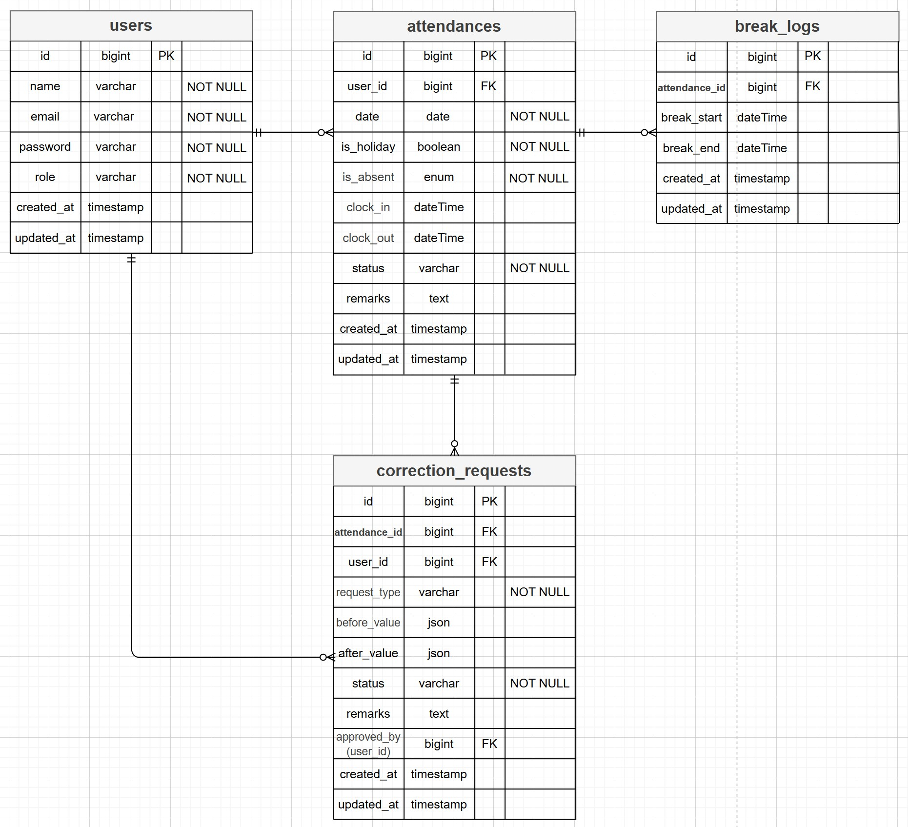

# attendance-flow

# ◎ coachtech 勤怠管理アプリ

本アプリは coachtech 仕様書（US001〜US015）に基づき、
勤怠管理に必要な機能を実装した学習用 Web アプリケーションです。

---

# ◎ 使用技術（実行環境）

- **PHP 8.x**
- **Laravel 8**
- **MySQL 8.0.32**
- **nginx 1.21.1**
- **Docker / Docker Compose**
- **CSS**
- **Laravel Fortify（認証）**


# ◎ 画面キャプチャ (Screenshots)

※本アプリの UI は多数存在しますが、README では アプリの全体像が最短で伝わる 4 画面 を厳選しています。

## ① スタッフ：出勤（打刻）画面



- スタッフが出勤・休憩・退勤を行うメイン画面です。現在のステータスに応じてボタン表示が切り替わり、
   UIState によって一貫した状態管理をしています。

## ② スタッフ：勤怠詳細（修正申請フォーム）



- 1 日分の勤怠詳細を確認できる画面です。休憩ログや備考などの整形は Presenter によって行われ、修正申請フォームから勤怠の差分を申請できます。

## ③ 管理者：日次勤怠一覧



- 管理者が当日の全スタッフの勤怠状況を確認する画面です。日付切り替えやステータス表示など、一覧表示に必要な加工を Presenter が担当しています。

## ④ 管理者：修正申請承認画面



- スタッフからの修正申請内容を確認し、承認を行う管理者用画面です。before/after の比較や承認後の勤怠反映など、実務に近いフローを再現しています。

---

# ◎ 主な機能一覧（仕様書 US001〜US015 に準拠）

## ◆ 認証（一般ユーザー / 管理者） US001〜US005

- 一般ユーザーの会員登録（メール認証あり）
- 一般ユーザーのログイン / ログアウト
- 管理者ログイン / ログアウト
- 認証メール再送
- 未認証ユーザーのアクセス制御
- 初回ログイン後の打刻画面遷移

## ◆ 打刻（出勤 / 休憩 / 退勤） US006

- 現在日時の表示
- ステータス表示（勤務外 / 出勤中 / 休憩中 / 退勤済）
- 出勤（1日1回）
- 休憩入 / 休憩戻（複数回可）
- 退勤（1日1回）
- 打刻内容は管理画面から確認可能

## ◆ 勤怠一覧（一般ユーザー） US007

- 自分の勤怠一覧表示
- 月の切り替え（前月 / 翌月）
- 勤怠詳細への遷移

## ◆ 勤怠詳細・修正申請（一般ユーザー） US008

- 出勤・退勤・休憩・備考の確認
- 休憩は回数分のレコードを表示
- 修正申請フォーム（承認待ちは編集不可）
- バリデーション（時刻整合性 / 備考必須）
- 修正申請の送信（承認待ちへ移動）

## ◆ 修正申請一覧（一般ユーザー） US009

- 承認待ち一覧
- 承認済み一覧
- 申請詳細（承認待ちは編集不可）
- 勤怠詳細画面への遷移

## ◆ 日次勤怠一覧（管理者） US010

- 全ユーザーの当日勤怠一覧
- 日付切り替え（前日 / 翌日）
- 勤怠詳細への遷移

## ◆ 勤怠詳細・修正（管理者） US011

- 出勤・退勤・休憩・備考の確認
- 管理者による直接修正
- バリデーション（時刻整合性 / 備考必須）
- 修正内容は一般ユーザー側にも反映

## ◆ スタッフ一覧（管理者） US012

- 全スタッフの一覧表示（氏名 / メールアドレス）
- 月次勤怠一覧への遷移

## ◆ スタッフ別 月次勤怠一覧（管理者） US013

- 選択したスタッフの月次勤怠一覧
- 月の切り替え（前月 / 翌月）
- CSV 出力
- 勤怠詳細への遷移

## ◆ 修正申請一覧（管理者） US014

- 承認待ち一覧
- 承認済み一覧
- 申請詳細への遷移

## ◆ 修正申請の承認（管理者） US015

- 申請内容の確認
- 承認処理
- 承認後は「承認済み」へ移動
- 一般ユーザーの勤怠情報へ反映

---

## ◆ 主なルーティング一覧 （web.php）※抜粋

### 一般ユーザー（スタッフ）

| 機能           | メソッド | パス                           | コントローラー                          |
| ------------- | -------- | ------------------------------ | --------------------------------------- |
| 出勤画面       | GET      | /attendance                    | AttendanceController@index              |
| 出勤/退勤/休憩 | POST     | /attendance                    | AttendanceController@action             |
| 勤怠一覧       | GET      | /attendance/list               | AttendanceController@list               |
| 勤怠詳細       | GET      | /attendance/detail/{id}        | AttendanceController@detail             |
| 修正申請一覧   | GET      | /stamp_correction_request/list | CorrectionRequestController@requestList |

### 管理者 ※抜粋

| 機能                 | メソッド | パス                         | コントローラー                             |
| ------------------- | -------- | ---------------------------- | ---------------------------------------- |
| 管理者ログイン       | GET      | /admin/login                 | AdminAuthController@showLogin             |
| 日次勤怠一覧         | GET      | /admin/attendance/list       | AdminAttendanceController@list            |
| 勤怠詳細             | GET      | /admin/attendance/{id}       | AdminAttendanceController@detail          |
| スタッフ一覧         | GET      | /admin/staff/list            | AdminAttendanceController@staffList       |
| スタッフ月次勤怠一覧 | GET      | /admin/attendance/staff/{id} | AdminAttendanceController@staffAttendance |

### 管理者：修正申請

| 機能            |  メソッド | パス                                   | コントローラー                    |
| --------------- | -------- | -------------------------------------  | -------------------------------- |
| 修正申請一覧     | GET      | /stamp_correction_request/admin/list   | CorrectionController@requestList |
| 修正申請承認画面 | GET      | /stamp_correction_request/approve/{id} | CorrectionController@showApprove |

## ◆ コントローラー 一覧 (Controller)

| コントローラー名                     | 役割                                                            |
| ----------------------------------- | -------------------------------------------------------------- |
| AttendanceController.php            | スタッフ側の出勤・退勤・休憩・勤怠一覧・勤怠詳細の処理              |
| CorrectionRequestController.php     | スタッフ側の修正申請一覧・修正申請送信処理                         |
| AuthController.php                  | スタッフ側のログイン・登録・メール認証                             |
| Admin/AdminAuthController.php       | 管理者ログイン処理                                               |
| Admin/AdminAttendanceController.php | 管理者側の日次勤怠一覧・勤怠詳細・スタッフ一覧・スタッフ月次勤怠一覧 |
| Admin/CorrectionController.php      | 管理者側の修正申請一覧・承認画面・承認処理                         |

## ◆ モデル 一覧（Model）

| モデルファイル名       | 説明                                          |
| --------------------- | -------------------------------------------- |
| User.php              | ユーザー（従業員・管理者）の属性と権限を表す     |
| Attendance.php        | 1 日分の勤怠記録を表す                         |
| BreakLog.php          | 勤務中の休憩ログを表す                         |
| CorrectionRequest.php | 勤怠修正申請(変更前後の差分と理由)を表す        |

## ◆ サービス 一覧（Service）

| サービス名                    | 役割（責務）                               |
| ---------------------------- | ----------------------------------------- |
| AuthService.php              | 会員登録時の保存処理を担当                  |
| AttendanceService.php        | 出勤・退勤・休憩など、勤怠に関する処理を集約  |
| CorrectionRequestService.php | 勤怠修正申請の作成・更新・承認処理などを担当  |


## ◆ プレゼンター 一覧（ Presenter / UIState）

### Presenters（表示用データ整形）

| ファイル名                             | 役割（責務）                                        |
| ------------------------------------- | -------------------------------------------------- |
| AdminDailyAttendanceListPresenter.php | 管理者の日次勤怠一覧の表示用データ整形                 |
| AttendanceDetailPresenter.php         | 勤怠詳細画面で使用する日付・時刻・ステータスなどの整形  |
| AttendanceListPresenter.php           | スタッフ側の勤怠一覧の表示用データ整形                 |
| AttendancePresenter.php               | スタッフの勤怠ステータス変更や勤怠合計時間等のデータ整形 |
| AttendanceRequestListPresenter.php    | スタッフ側の修正申請一覧の表示用データ整形              |
| BasePresenter.php                     | 各プレゼンターの共通処理を集約した親presenter          |
| CalendarPresenter.php                 | 月次カレンダー等のナビゲーションや表示構造の組み立て    |
| CorrectionRequestPresenter.php        | 管理者側の修正申請一覧・承認画面の表示用データ整形      |
| WorkMessagePresenter.php              | 勤怠ステータスの状態に応じたステータスメッセージの選定  |

### UIState（UI の状態判定）

| ファイル名             | 役割（責務）                                                  |
| --------------------- | -------------------------------------------------------------|
| AttendanceUIState.php | 出勤中／休憩中／退勤済みなど、勤怠画面のボタン表示・状態判定を担当 |

## ◆ ビュー 一覧（Bladeファイル）

ビュー（Blade）は以下のように役割ごとにディレクトリ分割しています：

- staff：スタッフ側の画面（ログイン・出勤・勤怠一覧・詳細・修正申請）
- admin：管理者側の画面（勤怠一覧・詳細・修正申請承認・スタッフ一覧）
- layouts：共通レイアウト（一般・管理者・ゲスト）
- partials：ナビゲーションなどの共通パーツ

### フロントエンド構成（CSS / JS）

CSS・JavaScript はページ単位と共通コンポーネントに分割されています。
詳細は `public/css/` および `public/js/` ディレクトリを参照してください。

---

# ◎ ディレクトリ構成（責務ごとの役割）

```bash
app/
├── Http/
│   ├── Controllers/        # 画面遷移・リクエスト受付
│   └── Requests/           # バリデーション
│
├── Models/                 # Eloquentモデル（DBアクセス）
│
├── Services/               # ビジネスロジック（勤怠処理・CSV出力など）
│
├── Support/
│     ├── Export/
│     │    └── AttendanceCsvExporter.php # CSV 出力準備
│     └── Url/
│         └── CsvExportUrl.php  # CSV 出力用 URL 生成ロジック
│
├── Presenters/            # 表示用データ整形（文字列・日付など）
│     └── UIState/         # UIの状態判定（ボタン表示・ステータス）
└── config/
 └── attendance.php       # 勤怠関連のステータス表示等の設定値

```

# ◎ 🐳 開発環境構築

## ◆ リポジトリのクローン

```bash
git clone git@github.com:nasu-masa/attendance-flow.git
cd attendance-flow
```

## ◆ Docker ビルド & 起動

```bash
docker-compose up -d --build
```

## ◆ Laravel セットアップ

```bash
docker-compose exec php bash
```

```bash
composer install
```

```bash
cp .env.example .env

php artisan key:generate

exit
```

```bash
code .        #.envファイルを必要に応じて環境変数変更）
```

## ◆ マイグレーション & シーディング

```bash
docker-compose exec php bash
```

```bash
php artisan migrate:fresh
php artisan db:seed
```

※Seeder により、以下のテストユーザーが作成されます。

# ◎ テストユーザー

## ◆ 管理者側

```bash

メールアドレス: admin@example.com
パスワード: test4343

```

## ◆ スタッフ側

```bash

メールアドレス: reina.n@coachtech.com
パスワード: test4343

```

◎その他のスタッフユーザーは、Factory および Seeder によって自動生成されています。

# ◎ 🔐 ログイン方法

アプリのログイン画面で、以下のテストユーザー情報を入力してください。

## ◆ 管理者ログイン

- メールアドレス

```bash
admin@example.com
```

- パスワード

```bash
test4343
```

## ◆ スタッフログイン

- メールアドレス

```bash
reina.n@coachtech.com
```

- パスワード

```bash
test4343
```

# ◎ ダミーデータの内容

## ◆ プロフィール関連（管理者・スタッフ共通）

- 名前（name）
- メールアドレス（email）
- パスワード（password）

## ◆ 勤怠関連（スタッフ）

- **2026年1月1日〜seeder 実行日前日までの勤怠データ**
  （その他のダミースタッフは **2026年1月1日〜Seeder 実行日まで** の勤怠データを保持）
  **修正申請データ**
- 承認待ち申請
- 承認済み申請

## ◆ テスト環境のセットアップ

Laravel のテストは `.env.testing` の設定を使用します。
本プロジェクトではテスト用データベース名として `demo_test` を使用しているため、
**事前に MySQL コンテナ内でデータベースを作成する必要があります。**

## 1. テスト用データベースの作成（重要）

```bash
docker exec -it <mysqlコンテナ名> bash
```
```bash
mysql -u root -p`
```

```bash
CREATE DATABASE demo_test;
SHOW DATABASES;
```
```bash
exit
```

※ `<mysqlコンテナ名>` は `docker ps` で確認できます。

## 2. テスト用マイグレーションの実行

```bash
docker compose exec php bash
php artisan migrate:fresh --env=testing
```

## 3. 権限エラーが出た場合の対処

MySQL の権限設定によっては、以下のようなエラーが出る場合があります：

コード
```bash
SQLSTATE[HY000] [1044] Access denied for user 'laravel_user'
```
その場合は、以下の手順で権限を付与してください。

```bash
docker compose exec mysql bash
mysql -u root -p
```
```bash
GRANT ALL PRIVILEGES ON demo_test.* TO 'laravel_user'@'%';
FLUSH PRIVILEGES;
```
```bash
exit
```
再度マイグレーションを実行します。

```bash
docker compose exec php bash
php artisan migrate:fresh --env=testing
```

## 4. テストの実行

```bash
php artisan test --env=testing
```

## ◆ 開発環境 URL

| 機能                  | URL                          |
| -------------------- | ---------------------------  |
| トップページ          | http://localhost/attendance  |
| ユーザー登録          | http://localhost/register    |
| ログイン              | http://localhost/login       |
| 管理者ログイン        | http://localhost/admin/login |
| phpMyAdmin           | http://localhost:8080/       |
| MailHog（メール確認） | http://localhost:8025/       |

---

# ◎ テーブル仕様書 & ER図

本アプリケーションは、仕様書（US001〜US015）に基づき
データベース設計を行っています。

以下に **ER図** と **テーブル仕様書** を掲載します。

---

## ◆ ER図（Entity Relationship Diagram）



ER図では以下のエンティティを定義しています：

- users
- attendances
- break_logs
- correction_requests

---

## ◆ テーブル仕様書


テーブル仕様書では以下の内容を定義しています：

- カラム名
- データ型
- 主キー
- ユニークキー
- NULL 許可
- 外部キー制約

本アプリのマイグレーションファイルは、
このテーブル仕様書と完全に一致するように実装しています。

---
> ※ 各サービスの構成は `docker-compose.yml` を参照してください

## ◎ 設計経緯・考え方

本アプリの設計は、実装を進めながら 「どの層が何を担当すべきか」
を段階的に整理していくプロセスで固まりました。

・まず、責務の境界を明確にする必要性を感じた
UI 表示・業務ロジック・データ整形・状態判定が混在すると保守性が落ちるため、
それぞれを独立した層に分離する方針を採用。

・Blade の可読性が低下し始めたため Presenter を導入
日付整形やステータス表示など、UI のための加工処理を Presenter に集約し、
Blade には “表示だけ” を残す構造に整理。

・Controller が肥大化してきたタイミングで Service 層を採用
出勤・退勤・休憩などの業務ロジックを Controller から切り離し、
「Controller＝交通整理」「Service＝業務処理」という役割に分離。

・Model に UI ロジックが混ざる問題に気づき、UIState を導入
Model は “データとその派生値” に限定し、
勤務中／休憩中などの UI 状態は UIState に切り出して純粋性を保つ。

・変更に強い構造を目指して Support 層を追加
CSV 出力や URL 生成など、UI と無関係な処理を独立させ、
仕様変更時の影響範囲を最小化。

このように、
実装しながら責務の境界を見直し続けた結果、現在の構造に落ち着きました。

## ◎ ライセンス

このプロジェクトは学習目的で作成されています。
