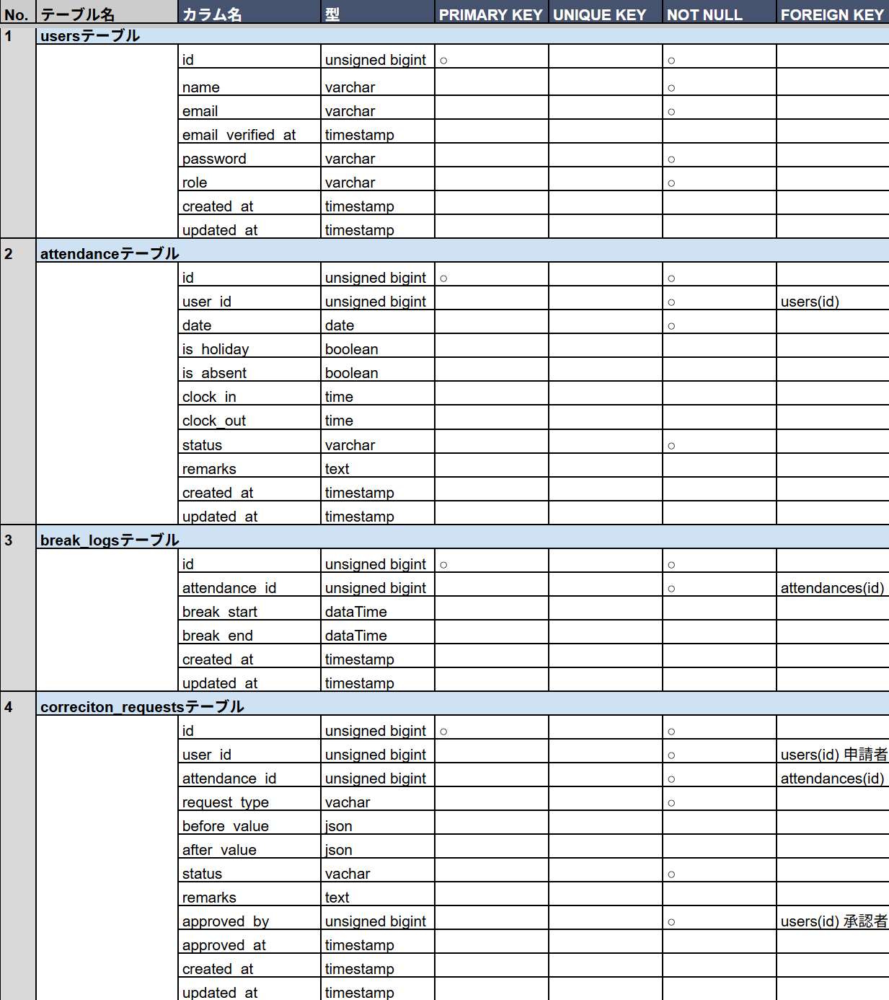

# attendance-flow

## ◎ coachtech 勤怠管理アプリ

本アプリは coachtech 仕様書（US001〜US015）に基づき、
勤怠管理に必要な機能を実装した学習用 Web アプリケーションです。

---

## ◎ 使用技術（実行環境）

- **PHP 8.x**
- **Laravel 8**
- **MySQL 8.0.32**
- **nginx 1.21.1**
- **Docker / Docker Compose**
- **CSS**
- **Laravel Fortify（認証）**

>※ 各サービスの構成は `docker-compose.yml` を参照してください

## ◎ 画面キャプチャ (Screenshots)

※本アプリの UI は多数存在しますが、README では アプリの全体像が最短で伝わる 4 画面 を厳選しています。

### ① スタッフ：出勤（打刻）画面


- スタッフが出勤・休憩・退勤を行うメイン画面です。
- 現在のステータスを UIState で一貫管理し、状況に応じて適切なボタン表示へ動的に切り替わる構造にしています。

### ② スタッフ：勤怠詳細（修正申請フォーム）


- 1日分の勤怠詳細を確認し、必要に応じて修正申請を行う画面です。
- 現在の申請ステータスの判定ロジックを画面表示から分離して整理することで、メンテナンス性の高い構造にしています。

### ③ 管理者：日次勤怠一覧


- 全スタッフの当日の勤怠状況をリアルタイムに確認できる管理者専用画面です。
- 管理者専用 Guard による厳密な認証を行い堅牢な設計にしています。

### ④ 管理者：修正申請承認画面


- スタッフからの修正申請を一覧管理し、承認フローを実行する画面です。
- before/after 形式の比較表示や、承認完了時に申請内容を勤怠データへ即時反映する実務的なロジックを再現しています。
---

## ◎ 主な機能一覧（仕様書 US001〜US015 に準拠）

### ◆ 認証（一般ユーザー / 管理者） US001〜US005

- 一般ユーザーの会員登録（メール認証あり）
- 一般ユーザーのログイン / ログアウト
- 管理者ログイン / ログアウト
- 認証メール再送
- 未認証ユーザーのアクセス制御
- 初回ログイン後の打刻画面遷移

### ◆ 打刻（出勤 / 休憩 / 退勤） US006

- 現在日時の表示
- ステータス表示（勤務外 / 出勤中 / 休憩中 / 退勤済）
- 出勤（1日1回）
- 休憩入 / 休憩戻（複数回可）
- 退勤（1日1回）
- 打刻内容は管理画面から確認可能

### ◆ 勤怠一覧（一般ユーザー） US007

- 自分の勤怠一覧表示
- 月の切り替え（前月 / 翌月）
- 勤怠詳細への遷移

### ◆ 勤怠詳細・修正申請（一般ユーザー） US008

- 出勤・退勤・休憩・備考の確認
- 休憩は回数分のレコードを表示
- 修正申請フォーム（承認待ちは編集不可）
- バリデーション（時刻整合性 / 備考必須）
- 修正申請の送信（承認待ちへ移動）

### ◆ 修正申請一覧（一般ユーザー） US009

- 承認待ち一覧
- 承認済み一覧
- 申請詳細（承認待ちは編集不可）
- 勤怠詳細画面への遷移

### ◆ 日次勤怠一覧（管理者） US010

- 全ユーザーの当日勤怠一覧
- 日付切り替え（前日 / 翌日）
- 勤怠詳細への遷移

### ◆ 勤怠詳細・修正（管理者） US011

- 出勤・退勤・休憩・備考の確認
- 管理者による直接修正
- バリデーション（時刻整合性 / 備考必須）
- 修正内容は一般ユーザー側にも反映

### ◆ スタッフ一覧（管理者） US012

- 全スタッフの一覧表示（氏名 / メールアドレス）
- 月次勤怠一覧への遷移

### ◆ スタッフ別 月次勤怠一覧（管理者） US013

- 選択したスタッフの月次勤怠一覧
- 月の切り替え（前月 / 翌月）
- CSV 出力
- 勤怠詳細への遷移

### ◆ 修正申請一覧（管理者） US014

- 承認待ち一覧
- 承認済み一覧
- 申請詳細への遷移

### ◆ 修正申請の承認（管理者） US015

- 申請内容の確認
- 承認処理
- 承認後は「承認済み」へ移動
- 一般ユーザーの勤怠情報へ反映

---

### ◆ 主なルーティング一覧 (Routing)

**一般ユーザー（Staff）**

`routes/web.php` で定義。スタッフの日常業務に関するルートです。

- **勤怠操作・一覧**
    - 出勤画面：`GET /attendance` (`AttendanceController@index`)
    - 打刻処理：`POST /attendance` (`AttendanceController@action`)
    - 勤怠一覧：`GET /attendance/list` (`AttendanceController@list`)
    - 勤怠詳細：`GET /attendance/detail/{id}` (`AttendanceController@detail`)
- **修正申請**
    - 申請一覧：`GET /stamp_correction_request/list` (`CorrectionRequestController@requestList`)

**管理者（Admin）**

`routes/admin.php` で定義。管理者専用 Guard により保護されています。

- **基本管理**
    - ログイン：`GET /admin/login` (`AdminAuthController@showLogin`)
    - 日次勤怠一覧：`GET /admin/attendance/list` (`AdminAttendanceController@list`)
    - 勤怠詳細：`GET /admin/attendance/{id}` (`AdminAttendanceController@detail`)
- **スタッフ管理**
    - スタッフ一覧：`GET /admin/staff/list` (`AdminAttendanceController@staffList`)
    - 個別月次一覧：`GET /admin/attendance/staff/{id}` (`AdminAttendanceController@staffAttendance`)
- **修正申請対応**
    - 申請一覧：`GET /stamp_correction_request/admin/list` (`CorrectionController@requestList`)
    - 承認・詳細：`GET /stamp_correction_request/approve/{attendance_correct_request_id}` (`CorrectionController@showApprove`)

---

### ◆ クラス設計・責務分離

**コントローラー (Controller)**

| **クライアント** | **コントローラー名** | **役割** |
| --- | --- | --- |
| **Staff** | `AttendanceController` | 打刻・一覧・詳細の制御 |
|  | `CorrectionRequestController` | 修正申請の送信・一覧 |
|  | `AuthController` | 登録・ログイン・メール認証 |
| **Admin** | `Admin/AdminAuthController` | 管理者専用ログイン |
|  | `Admin/AdminAttendanceController` | 各種勤怠一覧・詳細の管理 |
|  | `Admin/CorrectionController` | 修正申請の判定・承認 |

**プレゼンター (Presenter / UIState)**

表示ロジックを分離し、Viewの純粋性を保ちます。

- **表示整形 (Presenters)**
    - `AdminDailyAttendanceListPresenter`: 管理者向け一覧整形
    - `AttendanceDetailPresenter`: 勤怠詳細（日時・状態）整形
    - `AttendanceListPresenter`: スタッフ向け一覧整形
    - `AttendancePresenter`: 合計時間計算・ステータス加工
    - `BasePresenter`: プレゼンター共通基盤
    - `CalendarPresenter`: カレンダーナビゲーション構築
    - `CorrectionRequestPresenter`: 管理者向け申請・承認用整形
    - `CorrectionRequestListPresenter`: スタッフ向け申請一覧整形
    - `WorkMessagePresenter`: 状態に応じたメッセージ選定
- **状態判定 (UIState)**
    - `AttendanceUIState`: 出勤/休憩/退勤のボタン表示判定

**業務ロジック・データ (Service / Model)**

- **サービス (Service)**
    - `AuthService`: 会員登録処理
    - `AttendanceService`: 打刻・勤怠計算のコアロジック
    - `CorrectionRequestService`: 修正申請の作成・承認ワークフロー
- **モデル (Model)**
    - `User`: 属性・権限管理（Admin/Staff）
    - `Attendance`: 1日単位の勤怠レコード
    - `BreakLog`: 休憩時間の記録
    - `CorrectionRequest`: 修正申請の差分保持

---

### ◆ ディレクトリ構成

**ビュー (Blade)**

`resources/views/` 下を権限・役割ごとに完全分離しています。

- `staff/`: 一般スタッフ用画面
- `admin/`: 管理者専用画面（Guardにより保護）
- `layouts/`: 共通枠（Staff/Admin/Guest 別）
- `partials/`: 共通コンポーネント（ナビゲーション等）

**フロントエンド (CSS / JS)**

- `public/css/`: ページ別および共通コンポーネント (`common.css`, `layout.css` 等)
- `public/js/`: 状態制御および動的表示用
---

## ◎ ディレクトリ構成（責務ごとの役割）

```bash
app/
├── Http/
│   ├── Controllers/        # 画面遷移・リクエスト受付
│   └── Requests/           # バリデーション
│
├── Models/                 # Eloquentモデル（DBアクセス）
│
├── Services/               # ビジネスロジック（勤怠処理など）
│
├── Support/
│     ├── Export/
│     │    └── AttendanceCsvExporter.php # CSV 出力準備
│     └── Url/
│         └── CsvExportUrl.php # CSV 出力用 URL 生成ロジック
│
├── Presenters/            # 表示用データ整形（文字列・日付など）
│     └── UIState/         # UIの状態判定（ボタン表示・ステータス）
└── config/
 └── attendance.php        # 勤怠関連のステータス表示等の設定値

```

## ◎ 🐳 開発環境構築

### ◆ リポジトリのクローン

```bash
git clone git@github.com:nasu-masa/attendance-flow.git
cd attendance-flow
```

### ◆ Docker ビルド & 起動

```bash

docker-compose up -d --build

```

### ◆ Laravel セットアップ

```bash

docker-compose exec php bash
```

```bash

composer install
```

```bash

cp .env.example .env

php artisan key:generate

exit
```

```bash
code .    #.envファイルを必要に応じて環境変数変更）
```

### ◆ マイグレーション & シーディング

```bash
docker-compose exec php bash
```

```bash
php artisan migrate:fresh
php artisan db:seed
```

※Seeder により、以下のテストユーザーが作成されます。

## ◎ テストユーザー

### ◆ 管理者側

```bash

メールアドレス: admin@example.com
パスワード: test4343

```

### ◆ スタッフ側

```bash

メールアドレス: reina.n@coachtech.com
パスワード: test4343

```

◎その他のスタッフユーザーは、Factory および Seeder によって自動生成されています。

## ◎ 🔐 ログイン方法

アプリのログイン画面で、以下のテストユーザー情報を入力してください。

### ◆ 管理者ログイン

- メールアドレス

```bash
admin@example.com
```

- パスワード

```bash
test4343
```

### ◆ スタッフログイン

- メールアドレス

```bash
reina.n@coachtech.com
```

- パスワード

```bash
test4343
```

## ◎ ダミーデータの内容

### ◆ プロフィール関連（管理者・スタッフ共通）

- 名前（name）
- メールアドレス（email）
- パスワード（password）

### ◆ 勤怠関連（スタッフ）

- 2026年1月1日〜seeder 実行日前日までの勤怠データ
  （その他のダミースタッフは **2026年1月1日〜Seeder 実行日まで** の勤怠データを保持）

- 修正申請データ
- 承認待ち申請
- 承認済み申請

### **◆テスト環境のセットアップ**

1. テスト用 `.env.testing` ファイルの作成とアプリキーの生成

```bash
cp .env .env.testing  *# 必要に応じて環境変数を変更*
```

### **.env.testing の変更ポイント**

```bash

APP_ENV=testing

APP_DEBUG=true

DB_CONNECTION=mysql

DB_DATABASE=demo_test   ← テスト用DB名

DB_USERNAME=laravel_user

DB_PASSWORD=laravel_pass

```

### **.env からコピーしたAPP_KEYを削除し .env.testing用に作り直します**

```bash

php artisan key:generate --env=testing

```

```bash

exit;

```

2. テスト用データベースの作成（重要）

Laravel のテストは .env.testing の設定を使用します。

.env.testing に記載されている DB 名（例：demo_test）のデータベースを 事前に作成する必要があります。

```bash

docker exec -it <mysqlコンテナ名> bash

```

```bash

mysql -u root -p

```

```bash

CREATE DATABASE demo_test;

SHOW DATABASES;

```

```bash

exit;

```

※ <mysqlコンテナ名> は docker ps で確認できます。

3. テスト用マイグレーションの実行

テスト DB を作成したら、テーブルを作成します。

```bash

docker compose exec php bash

php artisan migrate:fresh --env=testing

```

もし権限エラーが出た場合：

```bash

docker compose exec mysql bash

mysql -u root -p

```

権限を付与する：

```bash

GRANT ALL PRIVILEGES ON demo_test.* TO 'laravel_user'@'%';

FLUSH PRIVILEGES;

exit;

```

```bash

docker compose exec php bash

```

再度migrate:freshを実行してください。

```bash

php artisan migrate:fresh --env=testing

```

4. テストの実行

```bash

php artisan test --env=testing

```

#### ◆ 開発環境 URL

| 機能                  | URL                          |
| --------------------- | ---------------------------- |
| トップページ          | http://localhost/attendance  |
| ユーザー登録          | http://localhost/register    |
| ログイン              | http://localhost/login       |
| 管理者ログイン        | http://localhost/admin/login |
| phpMyAdmin            | http://localhost:8080/       |
| MailHog（メール確認） | http://localhost:8025/       |

---

## ◎ テーブル仕様書 & ER図

本アプリケーションは、仕様書（US001〜US015）に基づき
データベース設計を行っています。

以下に **ER図** と **テーブル仕様書** を掲載します。

---

### ◆ ER図（Entity Relationship Diagram）


ER図では以下のエンティティを定義しています：

- users
- attendances
- break_logs
- correction_requests

---

### ◆ テーブル仕様書



テーブル仕様書では以下の内容を定義しています：

- カラム名
- データ型
- 主キー
- ユニークキー
- NULL 許可
- 外部キー制約

本アプリのマイグレーションファイルは、
このテーブル仕様書と完全に一致するように実装しています。

---

### ◎ 設計経緯・考え方

本アプリの設計は、実装を進めながら 「どの層が何を担当すべきか」
を段階的に整理していくプロセスで固まりました。

・まず、責務の境界を明確にする必要性を感じた
UI 表示・業務ロジック・データ整形・状態判定が混在すると保守性が落ちるため、
それぞれを独立した層に分離する方針を採用。

・Blade の可読性が低下し始めたため Presenter を導入
画面に表示するためのデータ整形（日時フォーマット・ステータス表示・文字列加工など）は、
すべて Presenter 層に集約し、Controller や Model に UI ロジックが混在しないように設計。

・Controller が肥大化してきたタイミングで Service 層を採用
出勤・退勤・休憩などの業務ロジックを Controller から切り離し、
「Controller＝交通整理」「Service＝業務処理」という役割に分離。

・Model に UI ロジックが混ざる問題に気づき、UIState を導入
Model は “データとその派生値” に限定し、
勤務中／休憩中などの UI 状態は UIState に切り出して純粋性を保つ。

・変更に強い構造を目指して Support 層を追加
CSV 出力や URL 生成など、UI と無関係な処理を独立させ、
仕様変更時の影響範囲を最小化。

・認証状態の干渉を防ぐため、マルチガード認証を採用
管理者とスタッフのログイン状態を完全に独立させるため、Guard と Route ファイルを物理的に分離。
完成間近での再編となりましたが、実務に即した厳密な権限管理を実現。

このように、
実装しながら責務の境界を見直し続けた結果、現在の構造に落ち着きました。

#### ◆ まとめ

全体として「責務の一元化」を重視し、UI 表示・業務ロジック・状態判定・データ整形が混在しないよう、
各層が担う役割をできる限り明確に分離しています。これにより、変更に強く、読み手にとって予測可能な構造を実現しています。
読んでいただきありがとうございました。

### ◎ ライセンス

このプロジェクトは学習目的で作成されています。
